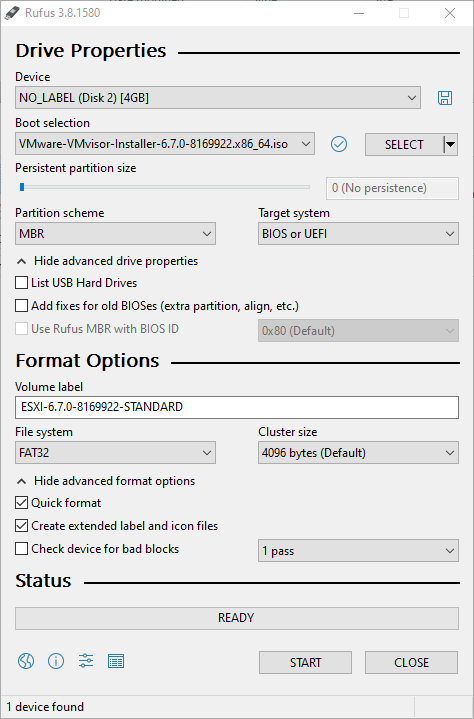
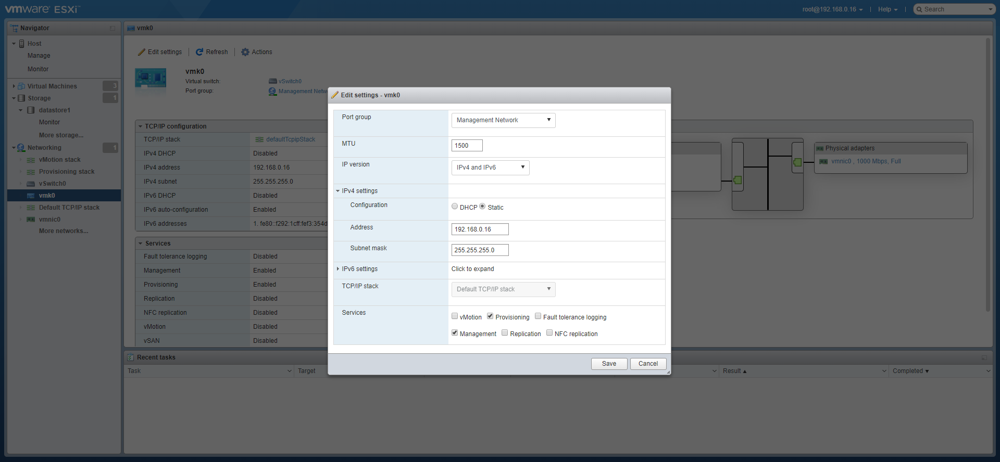
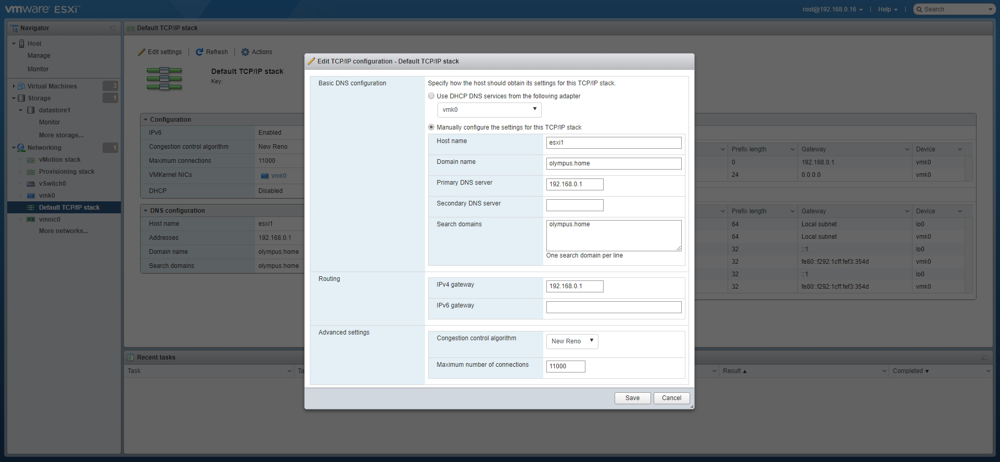

# Kubernetes on ESXi

## Install ESXi

I installed ESXi on an empty bare metal machine (without an OS) by running the ESXi installer from a boot USB disk.

To create that USB boot disk, I used [Rufus]( https://rufus.ie/ ), adding the [ESXi 6.7.0 install ISO]( https://my.vmware.com/en/web/vmware/evalcenter?p=free-esxi6 ).

I booted the empty machine with the USB disk and followed the installers instructions.

Once I had the ESXi up and running,

- I added the (free) license key
- I set the IP address of the ESXi to be fixed. 
- Setup the DNS
 
