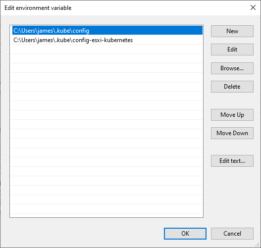

# kubectl

## Install

Follow the install guide from [kubernetes.io](https://kubernetes.io/docs/tasks/tools/install-kubectl/)

On windows, you can use choco to install it as well

```powershell
choco install kubernetes-cli
```

## Configure

Then configure your configuration by adding extra `KUBECONFIG` files

`kubectl` works with config files. You need to set the `KUBECONFIG`environment variable to contain all the files you would like to work with.



Each of the files describes your access to a particular cluster. To get that configuration, ssh into your master node and copy the config from `~/.kube/config`.

```bash
scp your-username@192.168.0.200:/home/your-username/.kube/config C:/Users/your-username/.kube/config-esxi-kubernetes
```

Make sure that there is no conflicting naming with other config files as each key has to be unique across config files. You could also point the `KUBECONFIG` to one file and switch contexts using the ENV variable. However when all are loaded, you can switch context with

```bash
kubectl config get-contexts                          # display list of contexts
kubectl config current-context                       # display the current-context
kubectl config use-context my-cluster-name           # set the default context to my-cluster-name

```

Once you selected the correct config, you should be able to describe the cluster on your local machine

```bash
kubectl cluster-info
```

Ref: [connecting to multiple clusters](https://kubernetes.io/docs/tasks/access-application-cluster/configure-access-multiple-clusters/)
