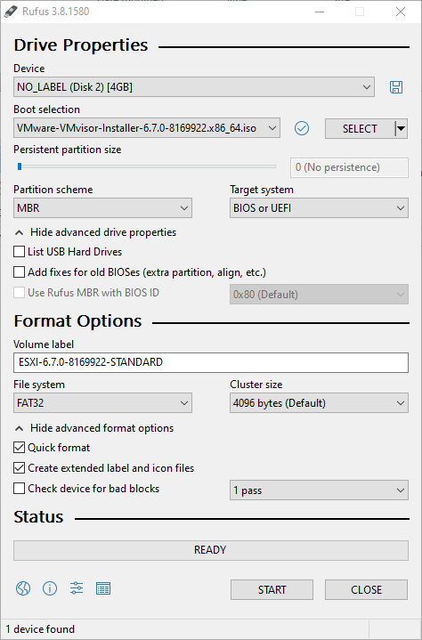
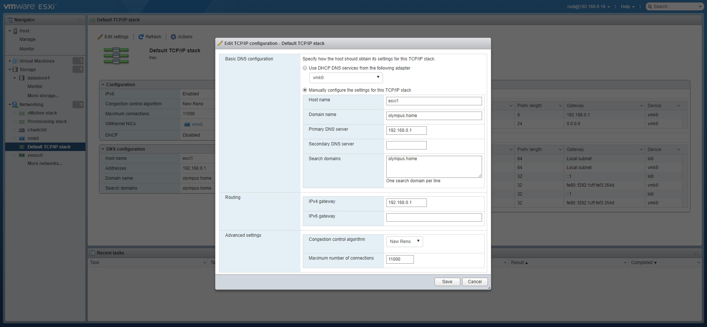
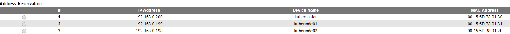
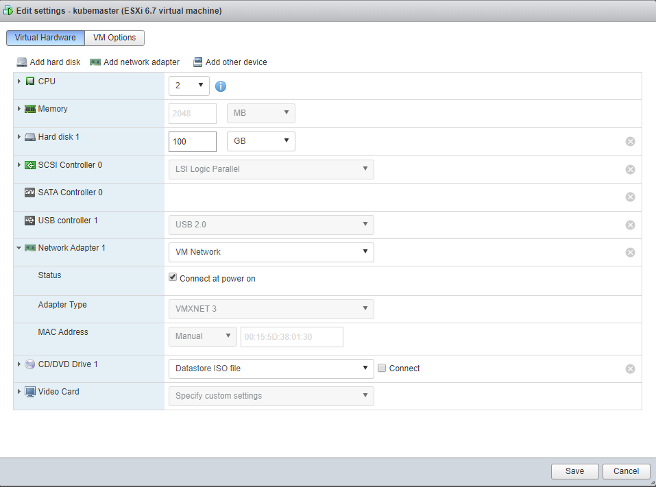
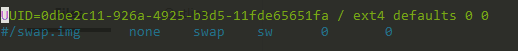

# Kubernetes on ESXi

## Install ESXi

I installed ESXi on an empty machine by running the ESXi installer from a boot USB disk.

To create that USB boot disk, I used [Rufus]( https://rufus.ie/ ), adding the [ESXi 6.7.0 install ISO]( https://my.vmware.com/en/web/vmware/evalcenter?p=free-esxi6 ). 



I booted the empty machine with the USB disk, following the installers instructions.

Once I had the ESXi up and running, 

- add the (free) license key
- set the IP address of the ESXi to be fixed.

- Setup the DNS

- 

## Create Kubernetes nodes

### Prepare networking

I added 3 MAC addresses to my router's DHCP settings, so that each machine would get the same IP from the DHCP server 



Next I added 3 new virtual machines, based on the [Ubuntu server 18.04 ISO]( http://releases.ubuntu.com/18.04/ ). Each machine was configured the same way, except for the MAC address of course. 

### Creating VM machines

Create 3 virtual machine with the following specs:



Add the Ubuntu ISO to the CD drive, which I downloaded from the site, then uploaded to the datastore.

Boot up each machine and just follow the installer of ubuntu server, accepting the defaults. I added the OpenSSH server and imported my github key so I didn't needed to setup ssh access any further.

Then SSH into each machine in a separate terminal.

```powershell
ssh 192.168.0.200
ssh 192.168.0.199
ssh 192.168.0.198
```

Next verify each machines ip address

```bash
sudo ip addr
```

### Install software

Next install docker

```bash
sudo apt-get update
sudo apt-get install -y docker.io
```

Next installer the kubernetes cli tools

```bash
sudo apt-get update && sudo apt-get install -y apt-transport-https curl
curl -s https://packages.cloud.google.com/apt/doc/apt-key.gpg | sudo apt-key add -
sudo cat <<EOF >/etc/apt/sources.list.d/kubernetes.list
deb http://apt.kubernetes.io/ kubernetes-xenial main
EOF
sudo apt-get update
sudo apt-get install -y kubelet kubeadm kubectl
```

 You need to install these on all the VMs. 

###  Tweak Ubuntu Settings

Disabling swap

```bash
sudo swapoff -a
```

Comment out the swap file in `/etc/fstab`

```bash
sudo nano /etc/fstab
```



Then delete the swap file

```bash
sudo rm -f /swap.img
```


```bash
sudo systemctl enable docker.service
```

## Setup kubernetes

### Setup the master node

On the master node initialize the cluster.

```bash
sudo kubeadm init
```


Run the proposed commands on the master

```bash
mkdir -p $HOME/.kube
sudo cp -i /etc/kubernetes/admin.conf $HOME/.kube/config
sudo chown $(id -u):$(id -g) $HOME/.kube/config
```

`kubeadm` does a lot of the heavy lifting required to setup a Kubernetes Cluster like installing a CA, generating certificates, installing and configuring `etcd`, getting addons like `CoreDNS`, `kube-proxy`. But one thing that is does not do is install a networking addon. For Kubernetes to work you need to have a pod network add-on. There are a lot of CNI providers and you can choose any of them. I chose Weave Net as it does not require any additional configuration. You install it on the Master node by running

```
kubectl apply -f "https://cloud.weave.works/k8s/net?k8s-version=$(kubectl version | base64 | tr -d '\n')"
```

### Add the worker nodes

Use the following command on each of the worker nodes

```bash
kubeadm join 192.168.0.200:6443 --token 5auxv4.26************90 --discovery-token-ca-cert-hash sha256:01e5ef2c************************************************6a4ff89564
```

At this point your Kubernetes Cluster is up and running. You can use the `kubectl` command from the Master node to query the cluster information.

```
kubectl cluster-info
kubectl get nodes
```


```
kubectl describe nodes
```

Once all are in the rady state we have a working Kubernetes cluster with 3 nodes (one master node and 2 worker nodes).

### Post install

we have `kubectl`once we ssh into the master node, but we might want to get the same access from an external machine. To do so, we copy the `~/.kube/config` to our local machine and add it to our local `KUBECONFIG` env variable.  More on this in [kubectl configuration](../kubectl/readme.md)

 

Ref:  http://vijayshinva.github.io/kubernetes/2018/07/28/setting-up-a-kubernetes-cluster-on-a-windows-laptop-using-hyper-v.html 