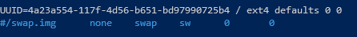

# Kubernetes

## Create Kubernetes nodes

### Prepare networking

I added 3 MAC addresses to my router's DHCP settings, so that each machine would get the same IP from the DHCP server


Next I added 3 new virtual machines, based on the [Ubuntu server 18.04 ISO]( http://releases.ubuntu.com/18.04/ ). Each machine was configured the same way, except for the MAC address of course.

### Creating VM machines

Create 3 virtual machine with the following specs:


Add the Ubuntu ISO to the CD drive, which I downloaded from the site, then uploaded to the datastore.

Boot up each machine and just follow the installer of ubuntu server, accepting the defaults. I added the OpenSSH server and imported my github key so I didn't needed to setup ssh access any further.


Then SSH into each machine in a separate terminal.

```powershell
ssh 192.168.0.200
ssh 192.168.0.199
ssh 192.168.0.198
```

Next verify each machines ip address

```bash
sudo ip addr
```

### Install software

Next install docker

```bash
sudo apt-get update
sudo apt-get install -y docker.io
```

Next installer the kubernetes cli tools

```bash
sudo apt-get update && sudo apt-get install -y apt-transport-https curl
curl -s https://packages.cloud.google.com/apt/doc/apt-key.gpg | sudo apt-key add -
sudo cat <<EOF >/etc/apt/sources.list.d/kubernetes.list
deb http://apt.kubernetes.io/ kubernetes-xenial main
EOF
sudo apt-get update
sudo apt-get install -y kubelet kubeadm kubectl
```

 You need to install these on all the VMs.

### Tweak Ubuntu Settings

Disabling swap

```bash
sudo swapoff -a
```

Comment out the swap file in `/etc/fstab`

```bash
sudo nano /etc/fstab
```



Then delete the swap file

```bash
sudo rm -f /swap.img
```

```bash
sudo systemctl enable docker.service
```

### Add DNS entries

```bash
sudo nano /etc/hosts
```

and add the following

```hosts
<vm-ip> <vm-name> <vm-name>.olympus.home
<vm-ip> rancher rancher.olympus.home
```

## Setup kubernetes

### Setup the master node

On the master node initialize the cluster.

```bash
sudo kubeadm init
```


Run the proposed commands on the master

```bash
mkdir -p $HOME/.kube
sudo cp -i /etc/kubernetes/admin.conf $HOME/.kube/config
sudo chown $(id -u):$(id -g) $HOME/.kube/config
```

`kubeadm` does a lot of the heavy lifting required to setup a Kubernetes Cluster like installing a CA, generating certificates, installing and configuring `etcd`, getting addons like `CoreDNS`, `kube-proxy`. But one thing that is does not do is install a networking addon. For Kubernetes to work you need to have a pod network add-on. There are a lot of CNI providers and you can choose any of them. I chose Weave Net as it does not require any additional configuration. You install it on the Master node by running

```bash
kubectl apply -f "https://cloud.weave.works/k8s/net?k8s-version=$(kubectl version | base64 | tr -d '\n')"
```

### Add the worker nodes

Use the following command on each of the worker nodes

```bash
kubeadm join 192.168.0.200:6443 --token 5auxv4.26************90 --discovery-token-ca-cert-hash sha256:01e5ef2c************************************************6a4ff89564
```

If you ever need to reconstruct this command, check out the [blog post of Scott Lowe]( https://blog.scottlowe.org/2019/08/15/reconstructing-the-join-command-for-kubeadm/ ).

At this point your Kubernetes Cluster is up and running. You can use the `kubectl` command from the Master node to query the cluster information.

```bash
kubectl cluster-info
kubectl get nodes
```


```bash
kubectl describe nodes
```

Once all are in the ready state we have a working Kubernetes cluster with 3 nodes (one master node and 2 worker nodes).

### Post install

#### Remote Kubectl

we have `kubectl` once we ssh into the master node, but we might want to get the same access from an external machine. To do so, we copy the `~/.kube/config` to our local machine and add it to our local `KUBECONFIG` env variable.

```bash
scp your-username@192.168.0.200:/home/your-username/.kube/config C:/Users/your-username/.kube/config-esxi-kubernetes
```

More on this in [kubectl configuration](../kubectl/readme.md)

#### Docker login for private repositories

To have the cluster be able to pull docker images from a private repository, refer to the [documentation]( https://kubernetes.io/docs/tasks/configure-pod-container/pull-image-private-registry/#registry-secret-existing-credentials ).

A `docker login` however will not store the credentials in the `config.json` as it is insecure, however you can easily create that credential as that's just the base64 encoded string of the username and password for the registry. Note that for github's package registry your password is to be a personal token, not the credentials you use to login.

```powershell
[Convert]::ToBase64String([System.Text.Encoding]::ASCII.GetBytes('$DOCKERHUB_USER:$DOCKERHUB_PASSWORD'))
```

or

```bash
echo -n '$DOCKERHUB_USER:$DOCKERHUB_PASSWD' | base64
```

and use the output in `config.json`

```json
{
   "auths": {
        "https://index.docker.io/v1/": {
            "auth": "$BASE64_STRING"
        }
    }
}
```

> **_WARNING_** Base64 is NOT encryption and should never be considered safe!

### MetalLb

Since we're runnig on a BareMetal cluster (not on Azure, GCE, AWS, ...), the loadbalancers don't get an IP assigned. Kubernetes doesn't offer that out of the box. A solution for this is [MetalLB](https://metallb.universe.tf/installation/)

```bash
kubectl apply -f https://raw.githubusercontent.com/google/metallb/v0.8.3/manifests/metallb.yaml
```

Then provide a config

```bash
kubectl apply -f ./src/kubernetes/metallb.yaml
```

Now each time a resource of type load balancer is started, MetalLB will assign it an external IP from the pool it was given.

### Pull private images

Basically follow the [kubernetes documentation](https://kubernetes.io/docs/tasks/configure-pod-container/pull-image-private-registry/).

Make sure your docker's `config.json` contains the secret.

```json
{
    "auths": {
        "https://index.docker.io/v1/": {
            "auth": "c3R...zE2"
        }
    }
}
```

> **_NOTE:_**  In case of github package registry, you use a personal token as the password to give access to your registries.

Add a secret with those docker credentials to your cluster and give it a name like `regcred`.

```bash
kubectl create secret generic regcred --from-file=.dockerconfigjson=C:/Users/<username>/.docker/config.json --type=kubernetes.io/dockerconfigjson
```

Then use that secret by name as part of your deployment

```yaml
spec:
    containers:
    image: private-image:1.0
    imagePullPolicy: IfNotPresent
    name: private-image
    imagePullSecrets:
    - name: regcred
    restartPolicy: Always
```

#### Footnotes

[^Reference: <http://vijayshinva.github.io/kubernetes/2018/07/28/setting-up-a-kubernetes-cluster-on-a-windows-laptop-using-hyper-v.html>]
