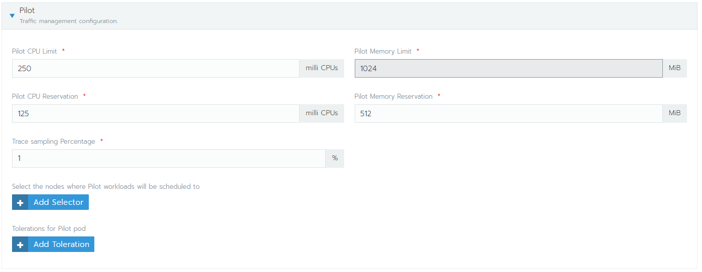
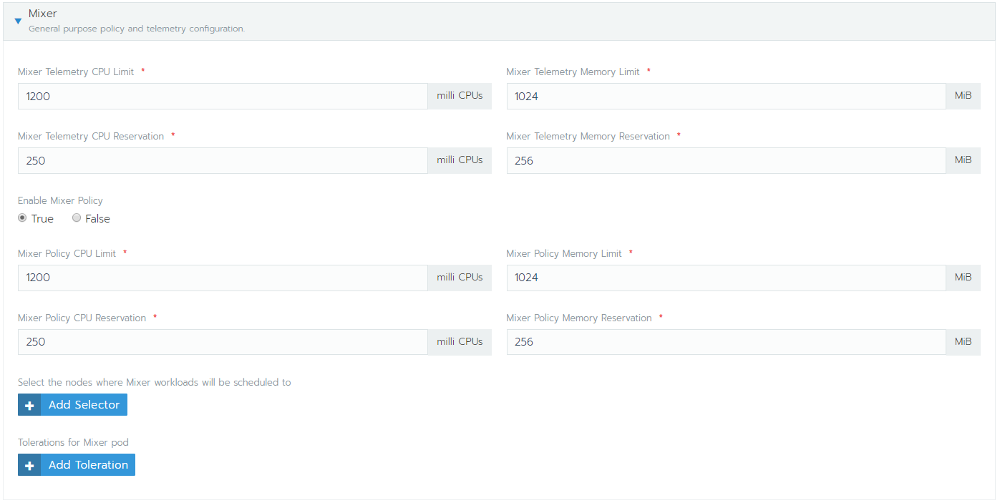
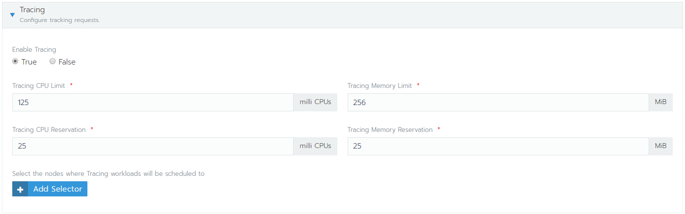

# Installing rancher

## Install cert-manager

Install the CustomResourceDefinition resources separately

```powershell
kubectl apply -f https://raw.githubusercontent.com/jetstack/cert-manager/release-0.10/deploy/manifests/00-crds.yaml
```

Create the namespace for cert-manager

```powershell
kubectl create namespace cert-manager
```

Label the cert-manager namespace to disable resource validation

```powershell
kubectl label namespace cert-manager certmanager.k8s.io/disable-validation=true
```

Add the Jetstack Helm repository

```powershell
helm repo add jetstack https://charts.jetstack.io
```

Update your local Helm chart repository cache

```powershell
helm repo update
```

Install the cert-manager Helm chart

```powershell
helm install --name cert-manager --namespace cert-manager --version v0.10.1 jetstack/cert-manager
```

```powershell
kubectl get pods --namespace cert-manager
```

## Install rancher

Provide an ingress proxy with SSL support. First create the certificate with mkcert (or omgwftssl) for the domain you want. Here we choose `rancher.localhost`

Do let's set hosts file accordingly.

- Windows:  c:\windows\system32\drivers\etc\hosts
- Mac/Linux: - /etc/hosts

Edit the appropriate file for your system and add an entry

```content
<your local ip> rancher.localhost
```

Next generate a certificate with [mkcert](https://github.com/FiloSottile/mkcert)

```powershell
mkcert rancher.localhost localhost 127.0.0.1 ::1
```

Make a copy of the generated certificate (not the key) and call it cacerts.pem

```powershell
copy rancher.localhost+3.pem cacerts.pem
```

Install an ingress proxy controller to expose the future rancher website. The rancher installer will create the ingress pointing to a certificate called cacerts.pem

```powershell
helm install stable/nginx-ingress --name ingress-nginx --namespace ingress-nginx --wait
```

Next install rancher

```powershell
helm repo add rancher-alpha https://releases.rancher.com/server-charts/alpha

kubectl create namespace cattle-system

kubectl -n cattle-system create secret generic tls-ca --from-file=cacerts.pem

kubectl -n cattle-system create secret tls tls-rancher-ingress --key ./rancher.localhost+3-key.pem --cert ./rancher.localhost+3.pem

helm install rancher-alpha/rancher --name rancher --namespace cattle-system --set hostname=rancher.localhost --set ingress.tls.source=secret --set privateCA=true --version 2.3.0-alpha7
```

Now open your browser at <https://rancher.localhost>

```powershell
kubectl -n cattle-system create secret tls rancher-cert --key ./rancher.localhost+3-key.pem --cert ./rancher.localhost+3.pem

```

## Monitoring & Istio install from Rancher

Rancher allow istio to be install automatically given minimum version `2.3.0-alpha5`

For the monitoring, divide the default by a factor 4, since for a single node that shoudl be more than enough.


Next add Istio. Same here, divide the default settings by 4. I used the following:




