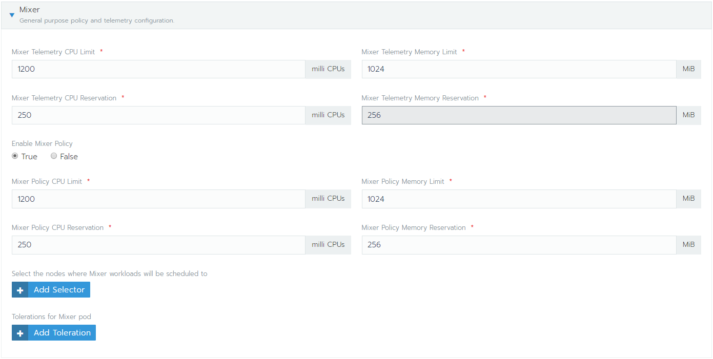

# Installing rancher

## Install cert-manager

Install the CustomResourceDefinition resources separately

```bash
kubectl apply -f https://raw.githubusercontent.com/jetstack/cert-manager/release-0.10/deploy/manifests/00-crds.yaml
```

Create the namespace for cert-manager

```bash
kubectl create namespace cert-manager
```

Label the cert-manager namespace to disable resource validation

```bash
kubectl label namespace cert-manager certmanager.k8s.io/disable-validation=true
```

Add the Jetstack Helm repository

```bash
helm repo add jetstack https://charts.jetstack.io
```

Update your local Helm chart repository cache

```bash
helm repo update
```

Install the cert-manager Helm chart

```bash
helm install --name cert-manager --namespace cert-manager --version v0.10.1 jetstack/cert-manager
```

```bash
kubectl get pods --namespace cert-manager
```

## Install rancher

### Add an ingress with TLS

Provide an ingress proxy with SSL support. First create the certificate with mkcert (or omgwftssl) for the domain you want. Here we choose `rancher.olympus.home`

Do let's set hosts file accordingly on your own machine

- Windows:  c:\windows\system32\drivers\etc\hosts
- Mac/Linux: - /etc/hosts

Edit the appropriate file for your system and add an entry

```content
<your local ip> rancher.<your domain>
```

Mine was

```plain
192.168.0.200 rancher.olympus.home
```

Add the same entries on your VM's in the `/etc/hosts` file of each VM.

Alternatively, if you have a local DNS running, you can add the entry there once (<== prefered).

Next generate a certificate with [mkcert](https://github.com/FiloSottile/mkcert)

```powershell
mkcert rancher.olympus.home localhost 127.0.0.1 ::1
```

mkcert will create local CA certificatge with which it'll sign the requested certificate. The cluster will need to know that CA certificate as well to verify its validity.

```powershell
copy %APPDATA%\mkcert\rootCA.pem ./cacerts.pem
```

Install an ingress proxy controller to expose the future rancher website. The rancher installer will create the ingress pointing to a certificate called `cacerts.pem`.

```powershell
helm install stable/nginx-ingress --name ingress-nginx --namespace ingress-nginx
```

Since we're running on bare-metal, kubernetes has no clue on which infrastructure it is running on. We need to expose the external ip directly

```bash
kubectl patch svc ingress-nginx-nginx-ingress-controller --namespace=ingress-nginx -p '{"spec": {"type": "LoadBalancer", "externalIPs":["192.168.0.200"]}}'
```

or get the service from the cluster

```bash
kubectl get services -o wide ingress-nginx-nginx-ingress-controller --namespace=ingress-nginx -o yaml > ./rancher/ingress-controller.yaml
```

Add the external IP manually and apply

```bash
kubectl apply -f ./rancher/ingress-controller.yaml
```

### Install Rancher

Next we're going to install rancher. We want the alpha version, since we would like to install istio later on.

```powershell
helm repo add rancher-latest https://releases.rancher.com/server-charts/latest

kubectl create namespace cattle-system
```

Add the certificates for the installer to find.

```bash
kubectl -n cattle-system create secret generic tls-ca --from-file=cacerts.pem

kubectl -n cattle-system create secret tls tls-rancher-ingress --key ./rancher.olympus.home+3-key.pem --cert ./rancher.olympus.home+3.pem
```

Run the helm chart

```bash
helm install rancher-latest/rancher --name rancher --namespace cattle-system --set hostname=rancher.olympus.home --set ingress.tls.source=secret --set privateCA=true --version 2.3.2-rc3
```

Now open your browser at [rancher](https://rancher.olympus.home) and create your login.


Note how the `cattle-cluster-agent` cannot start properly. That is due to the fact that we use a hostname that is not resolvable from the internet. We didn't use a DNS server to point to this installation.

We need to allow the agent to use the node's /etc/hosts file.


And save ;)

## Monitoring & Istio install from Rancher

### Monitoring with Prometheus

Adding monitoring through rancher, adds a Prometheus service to scrape the information from the cluster.


I slimmed down the defaults, since this cluster is not to take the heavy load a cluster usually does. We only use this one for demo purposes. In general go with the defaults for a production environment.

With monitoring enabled, we get extra live information.


### Istio

Rancher allows istio to be install automatically given minimum version `2.3.0-alpha5`. We installed Rancher `2.3.2-rc3`, so all good there.

Next add Istio. For this cluster, divide the default settings roughly by 4. I used the following:





Alternatively, you can use `istio-rancher-values.yaml` file and use that as an entry for the istio helm deployment under local Project System - Apps - Istio and upgrade it with the new values. These values are taken from the demo values of Istio source code and should suffice for a mini cluster. The minimal values are taking way too much cpu and memory into account and are designed for higher throughput (read production).
